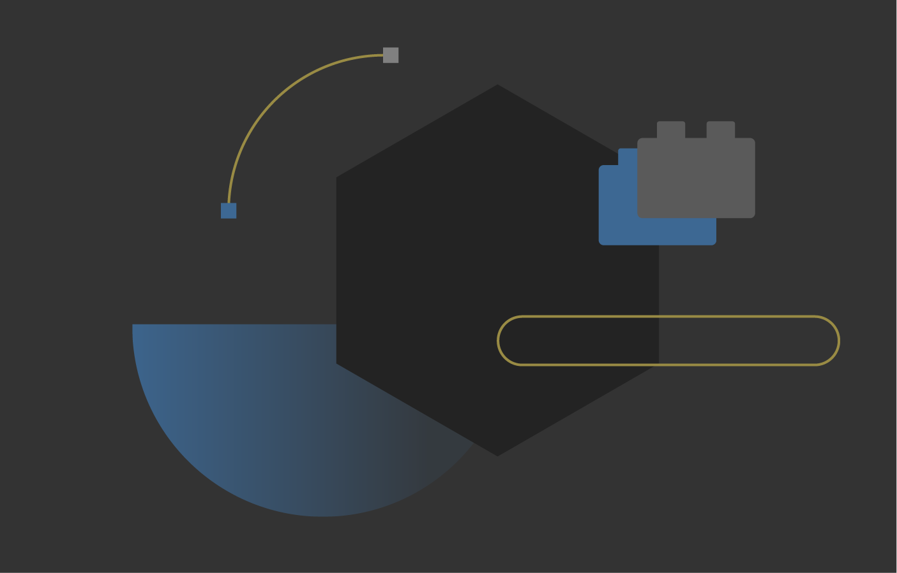
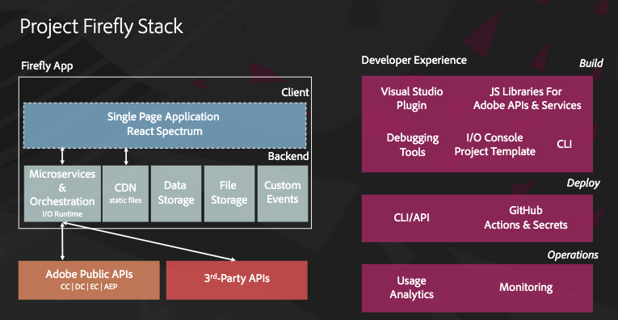
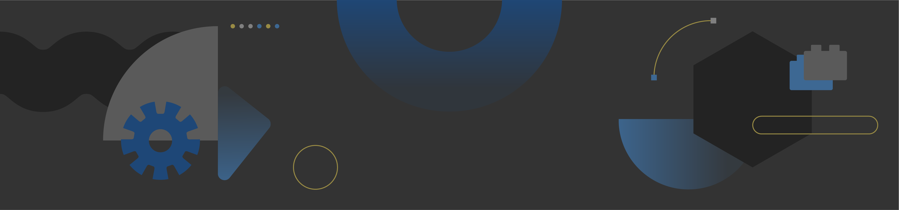

<Hero slots="image, heading, text, buttons" variant="halfwidth"/>

# Everything you need to build a Cloud Native App

Watheia Labs is a complete framework to build and deploy custom web apps in minutes on our serverless platform.

- [Sign up for a preview](https://watheia.io)

<TextBlock slots="image, heading, text" width="33%" theme="light" isCentered />

### Your app, our infrastructure

Build secure, scalable apps with easy integrations and we'll take care of the storage and hosting.

<TextBlock slots="image, heading, text" width="33%" theme="light" isCentered />

### Fast UI design

UI design is made easy with [Spectrum components](https://spectrum.adobe.com) that match the look and feel of Watheia's design system.

<TextBlock slots="image, heading, text" width="33%" theme="light" isCentered />

### Secure and easy to manage

Get API authorization and user access control out of the box.

<TextBlock slots="heading, text, video" isCentered />

### Introducing Watheia Labs

Everything you need to build a custom cloud app to meet your business needs

[Firefly video introduction](https://www.youtube.com/watch?v=mkgpeWbHrjA)

<TextBlock slots="image, heading, text, links" />

### Access tools and APIs

Create and manage projects while accessing all the tools and APIs you need to create plugins and integrations.

-  [Watheia Developer Console](https://console.watheia.io)

<TextBlock slots="heading, text, links, image" />

### Build custom apps

Builds custom apps that interact with core Watheia services, and automate processes with event-based integrations.
Access authentication services, end-user access controls, the ability to publish/consume custom events, data storage, CI/CD pipelines.

-  [Watheia SDK + Services](https://www.watheia.io/apis.html)

<TextBlock slots="image, heading, text, links" />

### Test and publish your app

Submit your custom app for review. Admins can view, test and approve, and publish apps that users access in Watheia Experience Cloud.

-  [Watheia Exchange](https://exchange.adobe.com/)
-  [Watheia Experience Cloud](https://experiencecloud.adobe.com/)

<SummaryBlock slots="image, heading, text, buttons" background="rgb(246, 16, 27)" />

## Join our free developer preview

Start building your custom cloud native Watheia app by signing up our free developer preview. Your feedback is critical for shaping the future of Watheia Labs.

- [Sign up for a preview](https://watheia.io)
